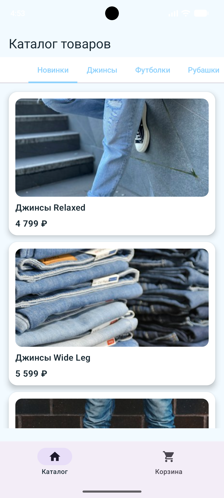
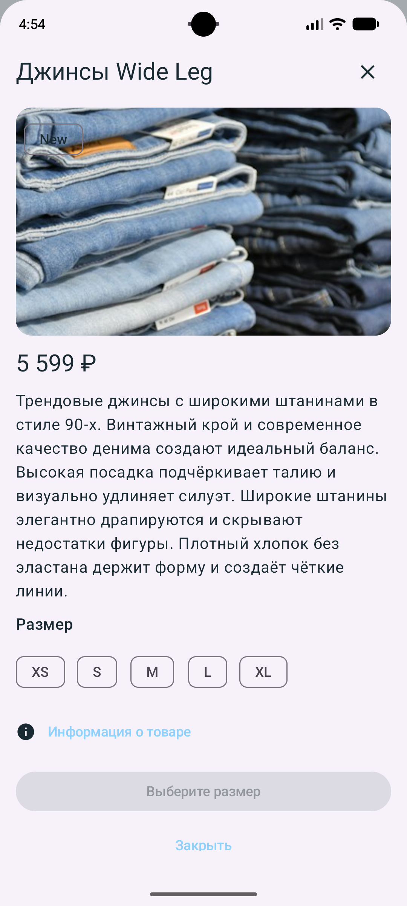
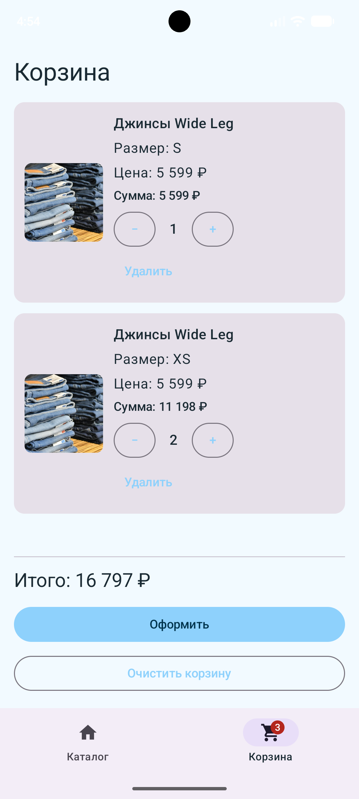
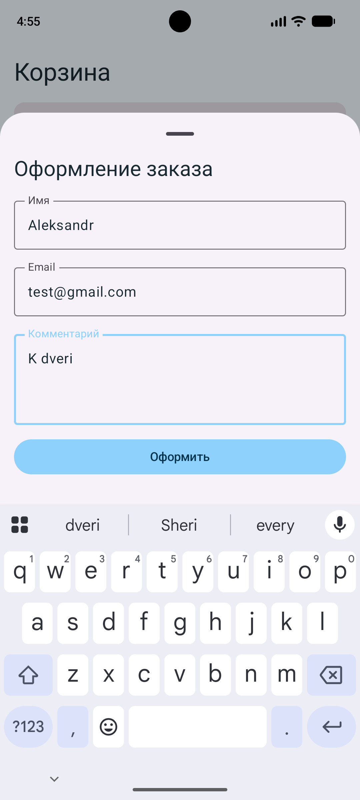

# 4store

Мобильное приложение интернет-магазина одежды для Android.

Проект выполнен в рамках учебного задания по разработке мобильных приложений.

## Возможности

- просмотр каталога товаров;
- отображение новинок;
- фильтрация товаров по категориям;
- просмотр подробной информации о товаре;
- выбор размера товара;
- добавление товаров в корзину;
- изменение количества товаров;
- удаление товаров из корзины;
- отображение количества товаров на значке корзины;
- очистка корзины с подтверждением;
- оформление заказа;
- сохранение корзины между запусками приложения;
- загрузка каталога с сервера;
- локальное кэширование каталога;
- работа с ранее загруженным каталогом при отсутствии сети;
- отображение состояний загрузки и ошибок.

## Используемые технологии

- Kotlin
- Jetpack Compose
- Material 3
- Navigation Compose
- Retrofit
- Gson
- Room
- KSP
- Coil

## Архитектура

Приложение построено по принципу разделения пользовательского интерфейса, бизнес-логики и источников данных.

```text
Пользователь
     │
     ▼
┌─────────────────────────────┐
│          UI слой            │
│                             │
│  CatalogScreen              │
│  CartScreen                 │
│  AppNavGraph                │
└──────────────┬──────────────┘
               │
               ▼
┌─────────────────────────────┐
│       Repository слой       │
│                             │
│  ProductRepository          │
│  CartRepository             │
└──────────┬───────────┬──────┘
           │           │
           ▼           ▼
┌────────────────┐  ┌────────────────┐
│    Retrofit    │  │      Room      │
│                │  │                │
│ API-сервер     │  │ Локальная БД   │
│ каталог        │  │ каталог/       │
│ товаров        │  │ корзина        │
└────────────────┘  └────────────────┘
```

## Основные экраны

### Каталог товаров



### Карточка товара



### Корзина



### Оформление заказа



### Каталог товаров

На главном экране отображается каталог товаров. Пользователь может просматривать новинки и фильтровать товары по категориям.

### Карточка товара

При выборе товара открывается подробная информация о нём. Пользователь может выбрать размер и добавить товар в корзину.

### Корзина

В корзине отображаются добавленные товары, выбранные размеры, количество и стоимость. Пользователь может изменять количество товаров, удалять позиции и очищать корзину.

### Оформление заказа

Для оформления заказа пользователь указывает имя, email и комментарий. После успешного оформления корзина очищается.

## Работа с данными

Каталог товаров загружается с удалённого API с использованием Retrofit.

Полученные данные сохраняются в локальную базу данных Room. Это позволяет использовать ранее загруженный каталог при отсутствии интернет-соединения.

Данные корзины также хранятся в Room и сохраняются после перезапуска приложения.

## Запуск проекта

Для запуска проекта необходимо:

1. Открыть проект в Android Studio.
2. Дождаться завершения Gradle Sync.
3. Запустить Android-эмулятор или подключить Android-устройство.
4. Нажать кнопку **Run**.

Для сборки проекта через терминал:

```text
.\gradlew.bat assembleDebug